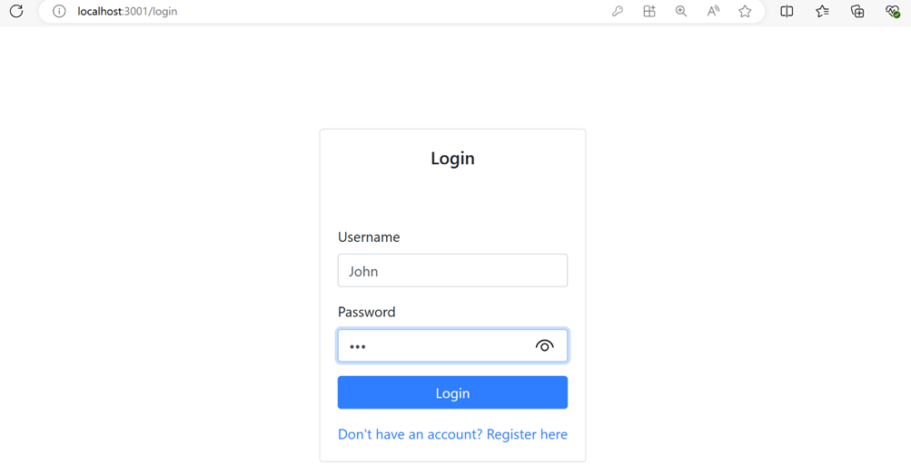
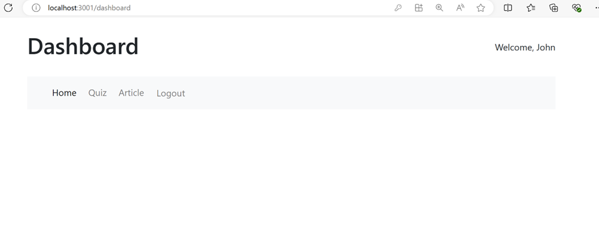
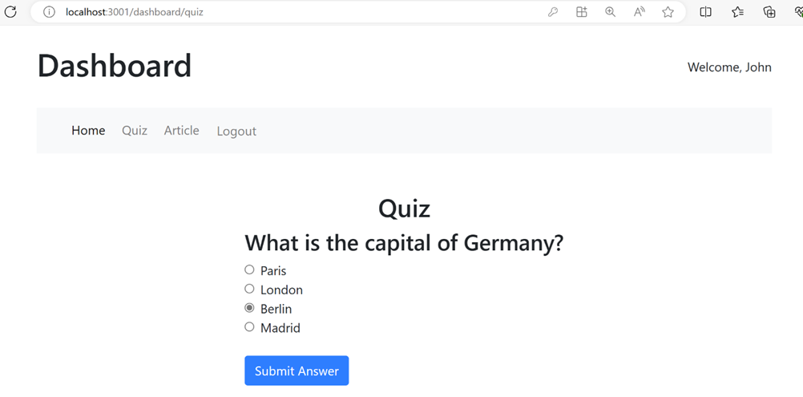
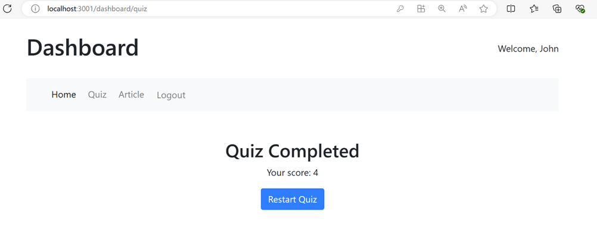
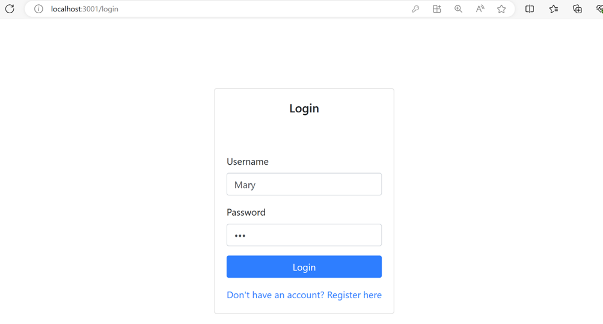
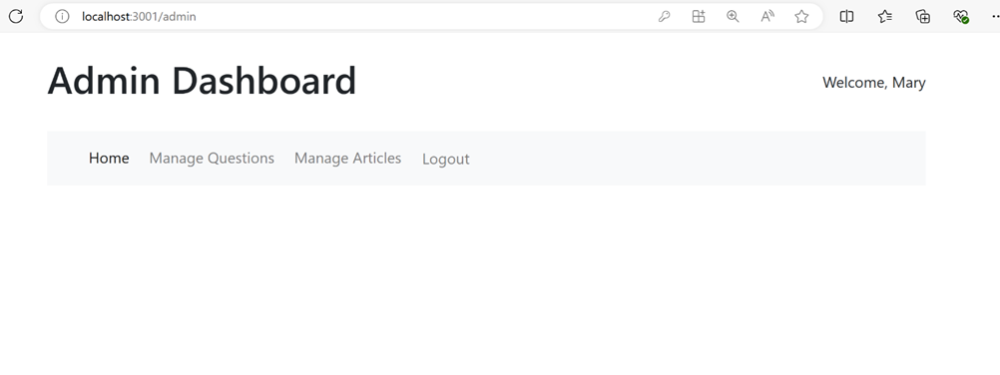
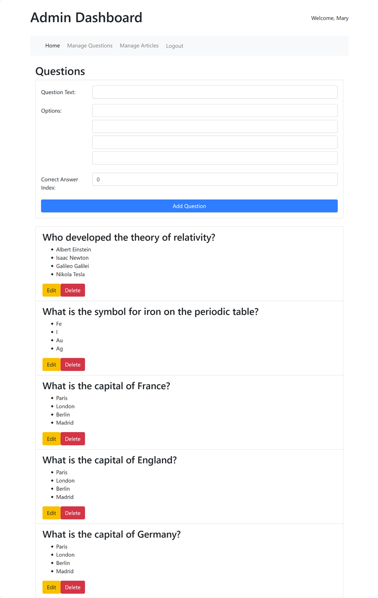

# Assignment 4 - Full-stack Application

## Instructions

In this assignment, you are required to build a full-stack quiz application using Node.js for the backend and React with Redux for the frontend. The backend will use Express and MongoDB to handle data storage and API endpoints, while the frontend will provide an interactive interface for users to take quizzes.

## Assignment Overview

At the end of this assignment, you should have completed the following:

- The backend handles the CRUD operations for quizzes and questions
- The frontend allows user login successfully before fetching and displaying quizzes using Redux for state management.

## Assignment Requirements

### 1. Backend

- **Express Server:** Set up an Express server to handle API requests.
- **MongoDB:** Use MongoDB for data storage.
- **Mongoose Models:** Define Mongoose models for Quizzes and Questions.
- **Routes:** Create API endpoints for creating, reading, updating, and deleting quizzes and questions.
- **Validation and Error Handling:** Implement validation and error handling for API requests.

### 2. Frontend

- **React:** Build the frontend using React.
- **Redux:** Use Redux for state management.
- **Routing:** Implement client-side routing with React Router.
- **Quiz Display:** Display quizzes and their questions.
- **Authentication:** Login, logout and signup user account. If user is admin, user can CRUD question and other ones can only take quizzes.
- **User Interaction:** Allow users to select options for questions and submit answers.
- **Styling:** Use Bootstrap 5 to style the application.

## Review Criteria

Your assignment will be graded on the basis of the following review criteria:

- Have a full-stack Node.js quiz application with an Express backend and a React frontend.
- The backend handles the CRUD operations for quizzes and questions, while the frontend allows user login successfully before fetching and displaying quizzes with Redux architecture. This is a basic setup that can be extended with more features such as user authentication, score tracking, and more.

## Demo Flow

1. Login successfully with user that is **not admin**
2. Click and do Quiz
3. Finish quiz
4. Login successfully with user that is an **admin**

## User

## Admin

